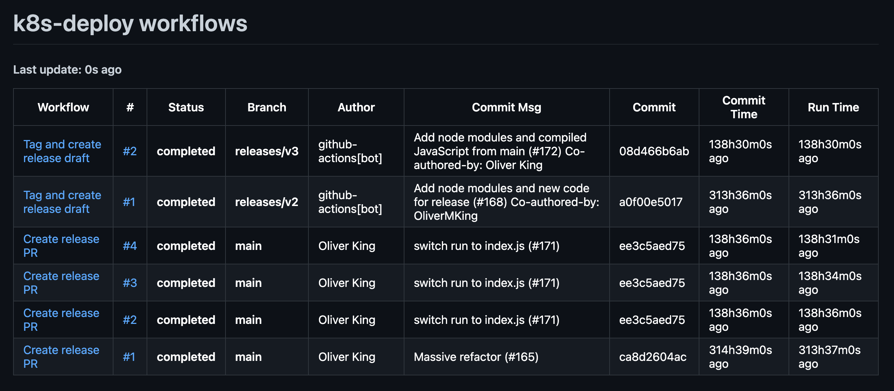

## CLI capable of retrieving github action workflows stats



### Example usage

- Dashboard mod
```shell
github-workflow-dashboard -server-mod -owner Azure -repo k8s-deploy  "Create release PR" "Tag and create release draft"
```

- CLI mod
```shell
github-workflow-dashboard -owner Azure -repo k8s-deploy  "Create release PR" "Tag and create release draft"
```

### Binaries
Prebuild binaries can be found [here](./bin/).  
In order to rebuild the project run `make go-build`

### Manual

```shell
Usage: github-workflow-dashboard [global flags] '<workflow>'

global flags:
  -format string
    	The format in which to print the workflow stats (ascii, json) (default "ascii")
  -owner string
    	Github repository owner
  -repo string
    	Github repository
  -server-mod
    	Start a web server that periodically pulls github workflow stats
  -server-poll-interval int
    	Interval in minutes used to poll github workflows (default 5)
  -server-port int
    	The port on which to start the web server if running in server-mod (default 8080)
  -token string
    	Github API token, see: https://docs.github.coim/en/articles/creating-an-access-token-for-command-line-use
  -version
    	Print version and exit

example:
	github-workflow-dashboard -owner Azure -repo k8s-deploy  "Create release PR" "Tag and create release draft"
```

### Environment variables
Command line args take precedence over env variables. If a cmd arg is not passed and an env variable is present then the env variable will be used.

```
WORKFLOW_TOKEN
WORKFLOW_OWNER
WORKFLOW_REPO
WORKFLOW_FORMAT
WORKFLOW_SERVER_MOD
WORKFLOW_SERVER_PORT 
WORKFLOW_SERVER_POLL_INTERVAL
WORKFLOW_CSV
```

### Running with docker

- Using Make
```shell
make docker-build
make docker-run
```

- Using Docker
```shell
docer build -t github-workflow-dashboard .

docker run -it -rm -e WORKFLOW_SERVER_MOD=true -e WORKFLOW_OWNER="Azure" -e WORKFLOW_REPO="k8s-deploy" -p 8080:8080 github-workflow-dashboard
```

